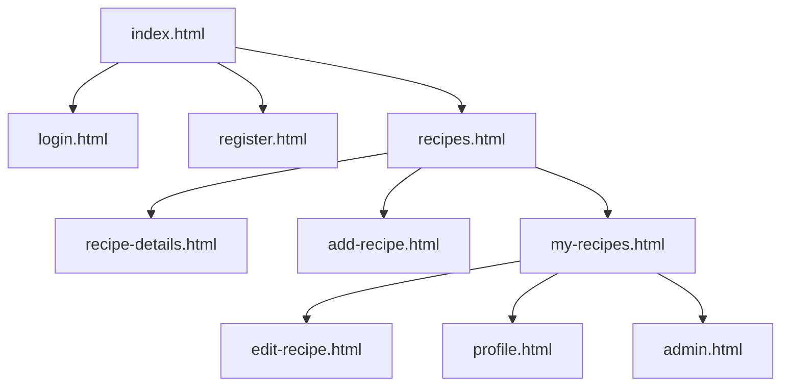
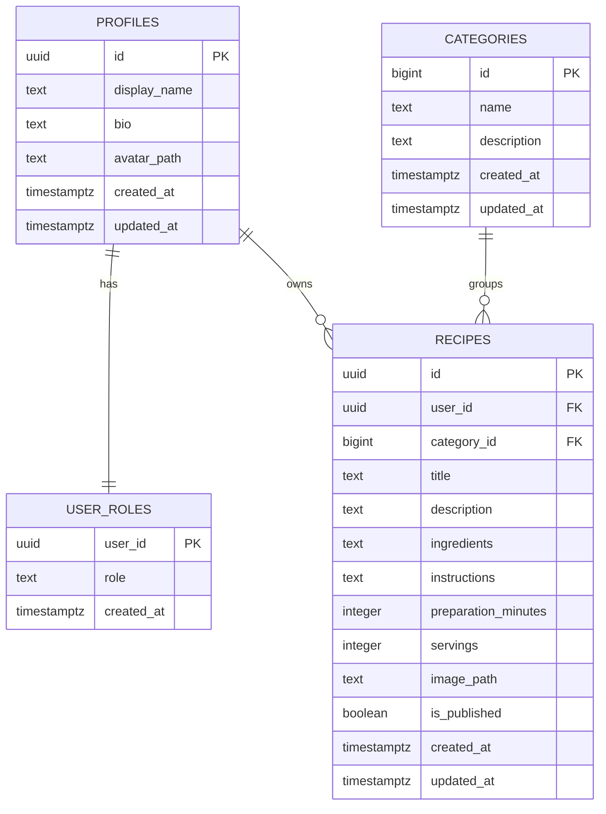

# RecipeBook

RecipeBook is a multi-page recipe management web application where users can register, log in, create recipes, edit their own content, upload profile and recipe images, and browse published recipes. Administrators can manage all recipes and categories

## Project Description

The application is designed for two main roles:

- Users can create, update, and delete their own recipes.
- Users can edit their profile information and upload an avatar.
- Everyone can browse published recipes.
- Administrators can access the admin panel and manage recipes and categories.

RecipeBook uses a simple multi-page structure instead of a SPA, which keeps the codebase easy to understand and maintain.

## Architecture

```mermaid
flowchart LR
	U[User Browser] --> P[HTML Pages\n(src/pages)]
	P --> J[JavaScript Modules\n(src/assets/js)]
	J --> B[Bootstrap 5 UI]
	J --> S[Supabase Client]
	S --> A[Supabase Auth]
	S --> D[Supabase Database]
	S --> F[Supabase Storage]

	D --> R1[profiles]
	D --> R2[user_roles]
	D --> R3[categories]
	D --> R4[recipes]
	F --> I1[recipe-images]
	F --> I2[profile-images]
```

### Architecture Overview



### Flow Notes

- Pages are separate HTML files and are loaded independently.
- Shared UI is rendered through reusable JS modules.
- Business logic is split into service files that talk to Supabase.
- Authentication, database access, and storage are all handled through Supabase.

### Front End

- HTML pages in `src/pages/`
- Reusable JavaScript modules in `src/assets/js/`
- Shared styling in `src/assets/css/`
- Bootstrap 5 for layout, forms, cards, modals, and alerts
- Vite for development and production builds

### Back End

- Supabase Authentication for sign-up, login, logout, and session handling
- Supabase Database for profiles, categories, recipes, and roles
- Supabase Storage for recipe images and profile avatars
- Row Level Security (RLS) for access control

### Technologies Used

- HTML
- CSS
- JavaScript ES Modules
- Bootstrap 5
- Node.js
- npm
- Vite
- Supabase

## Database Schema Design

Main tables and relationships:



### Schema Notes

- `profiles` stores public user profile data and avatar paths.
- `user_roles` stores whether a user is `user` or `admin`.
- `categories` stores recipe categories.
- `recipes` stores the main recipe content and links to both `profiles` and `categories`.

## Local Development Setup

### Prerequisites

- Node.js installed
- npm installed
- A Supabase project

### Environment Variables

Create a Vite environment file with the following values:

```env
VITE_SUPABASE_URL=your-supabase-project-url
VITE_SUPABASE_ANON_KEY=your-supabase-anon-key
```

### Install and Run

```bash
npm install
npm run dev
```

### Build for Production

```bash
npm run build
```

### Preview the Production Build

```bash
npm run preview
```

## Deployment (Netlify)

This project is ready for Netlify deployment.

### Netlify Build Settings

- Build command: `npm run build`
- Publish directory: `dist`

These are already configured in `netlify.toml`.

### Deploy Steps

1. Push the project to GitHub.
2. In Netlify, choose **Add new site** -> **Import an existing project**.
3. Select your GitHub repository.
4. Confirm build settings:
	- Build command: `npm run build`
	- Publish directory: `dist`
5. Add environment variables in Netlify Site Settings -> Environment Variables:
	- `VITE_SUPABASE_URL`
	- `VITE_SUPABASE_ANON_KEY`
6. Click **Deploy site**.

### Post-Deploy Check

- Open your live URL and verify it redirects to `src/pages/index.html`.
- Test login/registration and recipe loading.
- Confirm profile image upload and recipe image upload work with your Supabase policies.

## Key Folders and Files

### Root Files

- `index.html` - entry point that redirects or boots the app shell
- `package.json` - scripts and dependencies
- `vite.config.js` - Vite multi-page build configuration
- `README.md` - project documentation

### `src/pages/`

Contains the HTML pages for each route:

- `index.html` - home page
- `login.html` - login page
- `register.html` - registration page
- `recipes.html` - published recipes list
- `recipe-details.html` - single recipe view
- `add-recipe.html` - create recipe page
- `edit-recipe.html` - edit recipe page
- `my-recipes.html` - user-owned recipes page
- `profile.html` - profile management page
- `admin.html` - admin dashboard

### `src/assets/js/components/`

Shared UI components such as:

- navbar rendering
- footer rendering
- alert helpers

### `src/assets/js/pages/`

Page-specific logic for authentication, recipes, profile management, and admin actions.

### `src/assets/js/services/`

Business logic and API wrappers for:

- Supabase client setup
- authentication
- profile operations
- recipe operations
- category operations
- storage uploads and deletions

### `src/assets/js/utils/`

Reusable utility functions such as:

- auth guards
- validation helpers
- formatting helpers

### `src/assets/css/`

Shared styling for the entire application.

### `supabase/`

Contains local Supabase configuration and SQL migrations for schema, RLS, and storage policies.

## Notes

- The app expects authenticated users for create, edit, and profile actions.
- Image uploads are stored in Supabase Storage with RLS policies that restrict access by user ownership.
- Admin functionality depends on the `user_roles` table and the `public.is_admin()` helper.

## Live Project

https://recipebookvlad.netlify.app

## GitHub Repository

https://github.com/vlastomar/RecipeBook

### Administrator

- Email: vlad24@abv.bg
- Password: 123456

### Regular User

- Email: vlastomar@yahoo.com
- Password: 123456

## Author

Vladimir Marinov